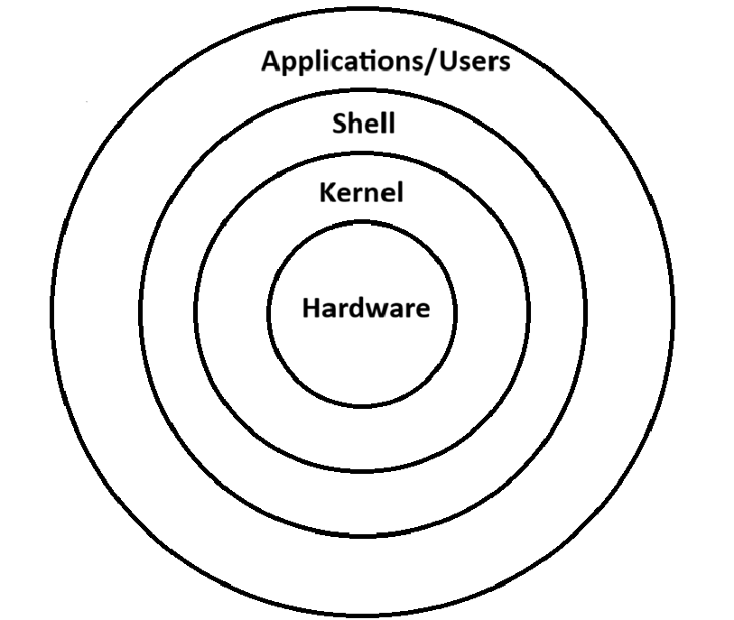

# Day02 - 90DaysOfDevOps

--- 

## Linux Architecture

**A S K H**

- **Applications:** User-level softwares(web browsers, tools)

- **Shell:** A command-line interface (CLI) or graphical interface (GUI) that interprets user commands and sends them to the kernel for execution.

- **Kernel:** The heart of the OS that operates in privileged kernel space, managing memory, CPU scheduling, device drivers, and file systems. It handles requests from user applications, ensuring efficient resource management and hardware abstraction.

- **Hardware Layer:** Physical components like hard drives, CPU, disks, peripheral devices

**init/systemd**
  - The first process started by the kernel (PID 1).  
  - Initializes the system, starts services, and manages them. 

A **process** is a running instance of a program on the system.
In Linux, processes are created using a combination of the **fork()** and **exec()** system calls.

- New process is created using fork()
- Child process may replace itself using exec()
- Parent can wait using wait()

### Process States
- **Running** → Actively using CPU.  
- **Sleeping** → Waiting for resources (I/O, signals).  
- **Zombie** → Finished execution but not cleaned up by parent.  
- **Stopped** → Suspended, waiting to be continued.
  
### 5 Daily Linux Commands
- `ps aux` → View all running processes.  
- `top` → Real-time CPU/memory usage.  
- `systemctl status <service>` → Check service health.  
- `journalctl -u <service>` → View logs for a service.  
- `kill -9 <PID>` → Forcefully stop a process. 

