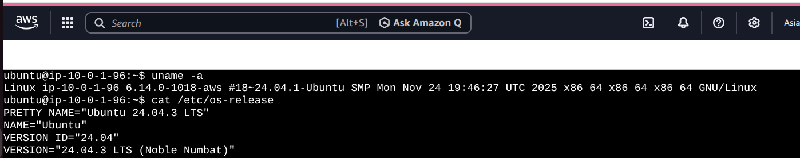
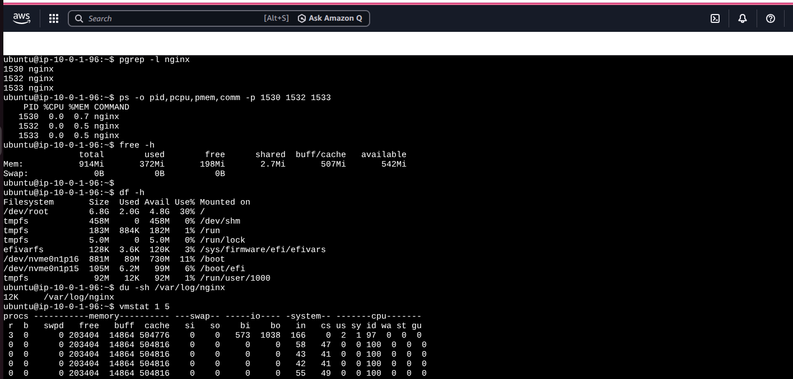
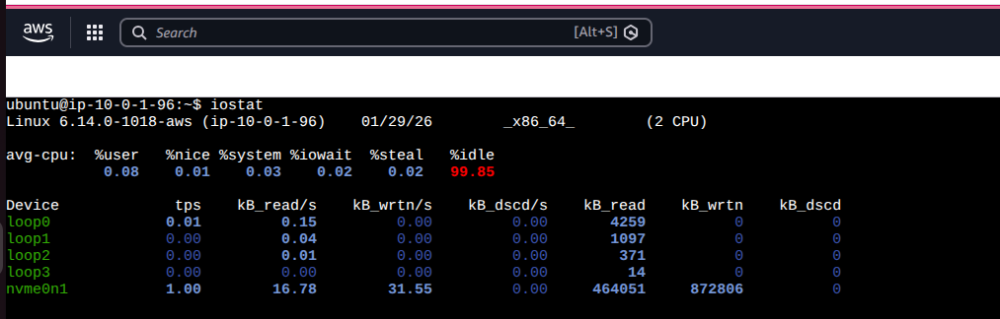
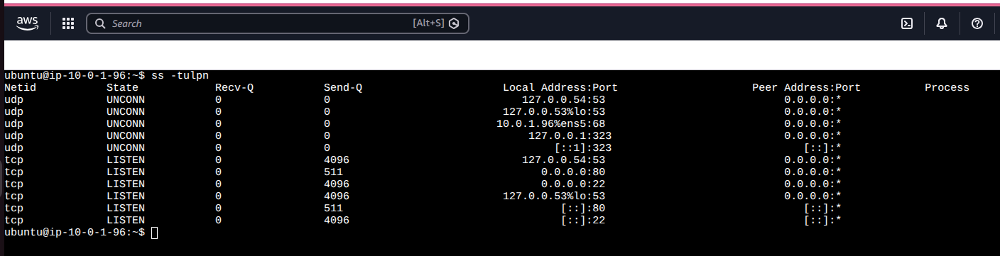
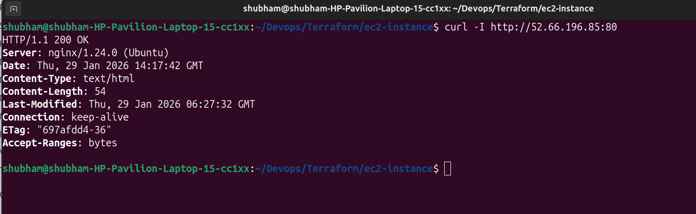
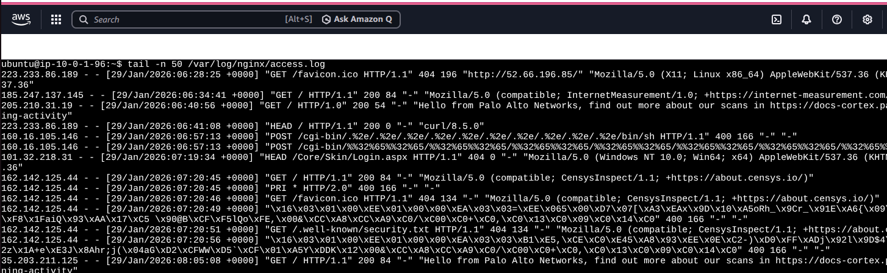
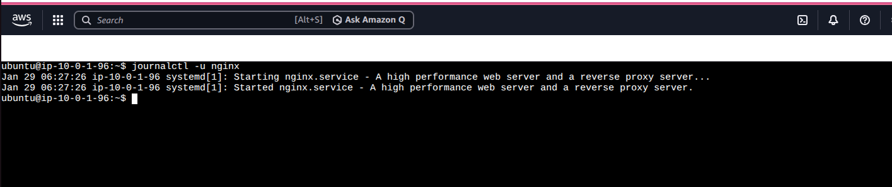

# Day 05 – Linux Troubleshooting Drill: CPU, Memory, and Logs

### Tagret service: Nginx

**1. Environment Basics**

- ```uname -a```
- ```cat /etc/os-release```

Observation:
- Confirmed Linux kernel version and Ubuntu distribution
- Ensured OS compatibility for systemd and nginx



**2. Process & CPU / Memory Snapshot**

- ```pgrep -l nginx```
- ```ps -o pid,pcpu,pmem,comm -p <pids>```
- ```free -h```
- ```df -h```
- ```vmstat 1 5```

Observation:
- nginx master and worker processes running
- CPU usage stable, no abnormal spikes
- Memory utilization within safe limits



**3. Disks & I/O checks**

- ```df -h```
- ```du -sh /var/log/nginx```
- ```iostat```

Observation:
- Root filesystem has sufficient free space
- Log directory size under control




**4. Network**

- ```ss -tulpn | grep nginx```
- ```ss -tulpn```
- ```curl -I http://publicip:80```

Observation:
- nginx listening on port 80
- HTTP 200 response confirms service availability





**5. Log Inspection**

- ```tail -n 50 /var/log/nginx/access.log```
- ```journalctl -u nginx```

Observation:
- No recent errors or warnings
- Service started cleanly without crashes






**Key Findings**

- nginx was healthy and responding correctly
- No resource exhaustion detected
- Logs were clean, confirming normal operation

**If this worsens (next steps)**

- **Test nginx configuration**
    sudo nginx -t
  
- **Restart the service**  
    sudo systemctl restart 

- **Increase log verbosity for deeper inspection**

- **Capture metrics using htop, vmstat, or monitoring tools**

- **Enable alerts for CPU, memory, and disk thresholds**
